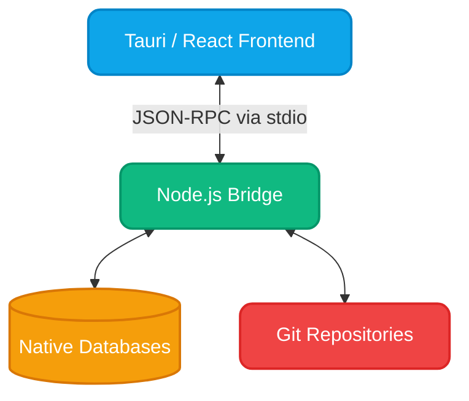

<div align="center">


# RelWave

**The Local-First Database Client for Modern Developers.**

_RelWave brings the power of native Git versioning, visual ER diagrams, and seamless schema management into one blazingly fast desktop application. Built for developers who demand more._

[](https://github.com/Relwave/relwave-app/releases)
[](LICENSE)
[](https://github.com/Relwave/relwave-app/releases)
[](https://tauri.app/)

[**🚀 Quick Start**](INSTALLATION.md) &nbsp;•&nbsp; [**📥 Download Now**](https://github.com/Relwave/relwave-app/releases) &nbsp;•&nbsp; [**📖 Documentation**](https://github.com/Relwave/relwave-app/wiki)

</div>

<br />

## ✨ Why RelWave?

**RelWave** isn't just another database query tool. It's a cohesive development environment where **schema exploration, visual modeling, and version control** collide. Built on a native bridge architecture, it delivers the raw power of low-level database drivers with the elegance of a modern React interface.

<div align="center">
<table>
  <tr>
    <td align="center" width="25%">
      <br />
      
      <br />
      <br />
      <b>Native Core</b>
      <br />
      <br />
      Direct connections via native drivers. Zero browser overhead. Pure speed.
    </td>
    <td align="center" width="25%">
      <br />
      
      <br />
      <br />
      <b>Git Integrated</b>
      <br />
      <br />
      First-class Git support. Branch, commit, and sync your schema changes naturally.
    </td>
    <td align="center" width="25%">
      <br />
      
      <br />
      <br />
      <b>Secure & Private</b>
      <br />
      <br />
      Local-first design. Encrypted credentials stored securely in your system's keyring.
    </td>
    <td align="center" width="25%">
      <br />
      
      <br />
      <br />
      <b>Visual First</b>
      <br />
      <br />
      Interactive ER Diagrams, Query Builders, and Data Visualization built right in.
    </td>
  </tr>
</table>
</div>

<br />

## 🛠️ Technology Stack

RelWave is built using a modern, high-performance tech stack ensuring both a buttery-smooth UI and robust backend operations.

<div align="center">
<br />

<br />
<br />
<i>Powered by Tauri, React 19, and a high-speed Node.js Bridge.</i>
</div>

<br />

## 🚀 Quick Start

### 📥 Download

For a full setup guide, see [INSTALLATION.md](INSTALLATION.md).

| OS          | Format               | Link                                                                  |
| :---------- | :------------------- | :-------------------------------------------------------------------- |
| **Windows** | `.exe` / `.msi`      | [Download Installer](https://github.com/Relwave/relwave-app/releases) |
| **Linux**   | `.deb` / `.AppImage` | [Download Package](https://github.com/Relwave/relwave-app/releases)   |

### 💻 Development Setup

Want to build RelWave from source? It's easy:

```bash
# Clone the repository
git clone https://github.com/Relwave/relwave-app.git
cd relwave-app

# Install dependencies (Main App & Node Bridge)
pnpm install
pnpm --dir bridge install

# Build the Bridge
pnpm bridge:package

# Launch development environment
pnpm tauri dev
```

> **Note:** If you need custom bridge database values, copy `bridge/.env.example` to `bridge/.env` and adjust your local settings.

<br />

## 🏗️ Architecture

RelWave leverages a **Hybrid Bridge Architecture**. This unique setup ensures that while the React UI remains fluid and highly responsive, the heavy-duty database connections and Git operations run securely inside a dedicated, isolated Node.js process.



<br />

## 🤝 Contributing

We absolutely love contributions! Whether it's a bug fix, a new database driver, or a UI enhancement, your help makes RelWave better for everyone.

Check out our full contributing guide in [CONTRIBUTING.md](CONTRIBUTING.md).

1. **Fork** the project.
2. **Create** your feature branch: `git checkout -b feature/amazing-feature`
3. **Commit** your changes: `git commit -m 'feat: add amazing feature'`
4. **Push** to the branch: `git push origin feature/amazing-feature`
5. **Open** a Pull Request.

<br />

---

<div align="center">
  <b>Built with ❤️ by the RelWave team.</b><br /><br />
  <a href="https://github.com/Relwave/relwave-app/issues">Report Bug</a> · 
  <a href="https://github.com/Relwave/relwave-app/issues">Request Feature</a>
</div>
